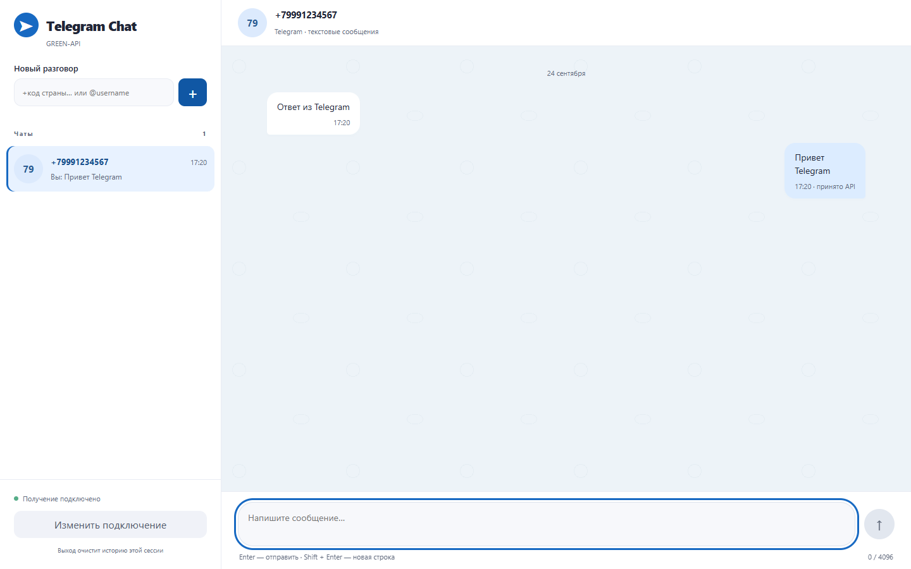
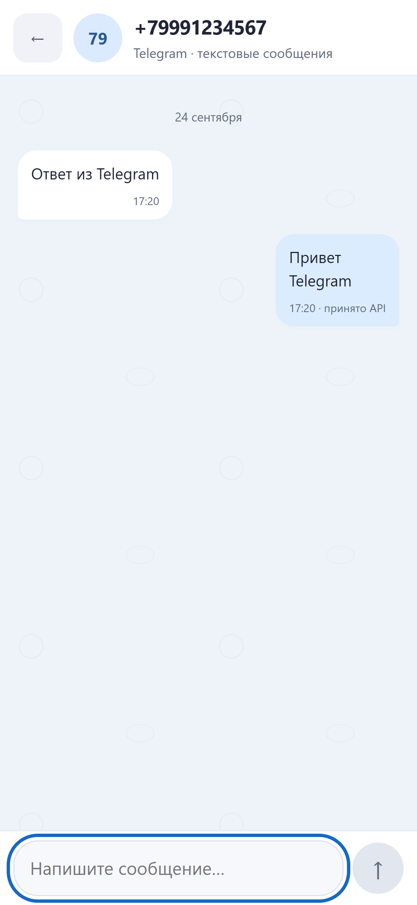
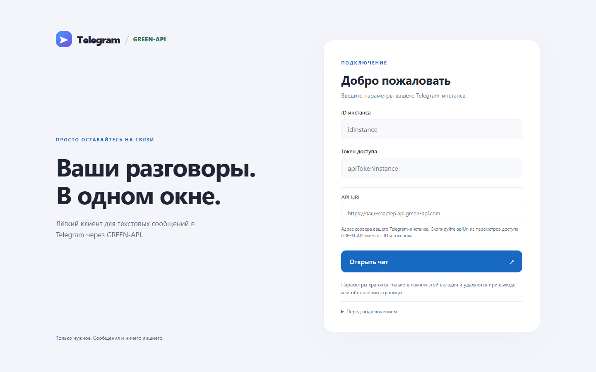

# GREEN-API Telegram Chat

Тестовое задание Frontend React: отправка и получение текстовых сообщений Telegram через GREEN-API. Desktop-интерфейс со списком чатов и отдельный экран переписки на мобильном.

**Telegram выбран по условиям задания**, разрешающим Telegram или WhatsApp вместо MAX. Визуальный ориентир — [web.max.ru](https://web.max.ru/); приложение сохраняет собственный брендинг Telegram / GREEN-API.

## Live Demo

[Открыть Telegram Chat](https://ovchinnikovnikitakonst.github.io/green-api-telegram-chat/)

Deployment: GitHub Pages через GitHub Actions, Node.js 24, публикация только production build из `dist`.

## Скриншоты







## Стек

React 19, TypeScript strict, Vite, CSS. Проверки: ESLint, Vitest, Playwright. Без UI-библиотеки, backend и базы данных.

## Быстрый запуск

Node.js 22.13+ из ветки 22 LTS либо Node.js 24+ и npm:

```sh
npm ci
npm run dev
```

Откройте адрес Vite, обычно `http://127.0.0.1:5173/`. Для просмотра production build: `npm run build`, затем `npm run preview` и `http://127.0.0.1:4173/green-api-telegram-chat/`.

## Работа с GREEN-API

1. Создайте Telegram-инстанс в [личном кабинете](https://console.green-api.com/) и авторизуйте личный Telegram-аккаунт по [официальной инструкции](https://green-api.com/telegram/docs/before-start/). Это не Telegram Bot API.
2. Скопируйте `idInstance`, `apiTokenInstance` и `apiUrl` из параметров доступа в форму приложения.
3. Введите международный телефон или `@username`. [CheckAccount](https://green-api.com/telegram/docs/api/service/CheckAccount/) возвращает `chatId`; приложение не вычисляет его самостоятельно.
4. Отправляйте текст кнопкой или Enter; Shift+Enter добавляет строку. Лимит — 4096 символов. При ошибке черновик сохраняется, автоматической повторной отправки нет.

**Почему есть третье поле:** исходное задание называет ID и токен, но [формат запросов GREEN-API Telegram](https://green-api.com/telegram/docs/request-format/) включает ещё хост `apiUrl`, который [выдаётся в кабинете](https://green-api.com/telegram/docs/before-start/). Документация Telegram не гарантирует единый хост или формулу его получения из ID. Поэтому адрес вводится отдельно, без догадок и общего хоста по умолчанию. Завершающий `/` нормализуется. `mediaUrl` не нужен: поддерживается только текст.

## Получение сообщений

В настройках инстанса включите **«Получать уведомления о входящих сообщениях и файлах»** (`incomingWebhook: yes`), а `webhookUrl` оставьте пустым для [получения через HTTP API](https://green-api.com/telegram/docs/api/receiving/technology-http-api/). Используйте один клиент на очередь.

Последовательность: `ReceiveNotification` → обработка → `DeleteNotification`. Повторы сообщений исключаются; при выходе запросы отменяются. Временные ошибки повторяются с задержкой, HTTP 400/401/403 останавливают получение до нового подключения.

При выключенном `incomingWebhook` новые сообщения не попадают в очередь, и пустая очередь возвращает `null`. Такой же ответ нормален, когда новых уведомлений нет.

## Архитектура

- `src/components` — формы, список чатов и переписка.
- `src/hooks/useMessenger.ts` — состояние сессии и жизненный цикл запросов.
- `src/api` — HTTP-клиент, последовательный polling и parser Telegram-уведомлений.
- `src/utils` — проверка адреса API и нормализация получателя.

История хранится в текущей сессии. Входящие тексты распределяются по `senderData.chatId`; поддерживаются `textMessage` и `extendedTextMessage`.

## Безопасность

Credentials вводятся пользователем только в браузере и хранятся только в памяти приложения. Выход или обновление страницы очищает их и историю. Токен скрыт в форме; приложение не пишет его в console, storage или сообщения об ошибках. Реальные credentials и payload не входят в репозиторий и тесты.

Адрес API ограничен HTTPS-хостами GREEN-API (`api.green-api.com` и числовые поддомены `.api.green-api.com`). Текст не интерпретируется как HTML. Внешние шрифты, scripts, assets и analytics не подключаются. По протоколу GREEN-API токен присутствует в URL запроса и виден в DevTools — сетевые логи с реальными параметрами не следует публиковать.

## Тестирование

```sh
npm run lint
npm run build
npm test
npm run test:e2e
npm audit --omit=dev
git diff --check
```

E2E требуют установленный Microsoft Edge и используют подставные ответы API, desktop 1440px и mobile 375px. Проверяются отправка, получение, дубли, ошибки, отмена запросов, длинный текст и UI-состояния. Скриншоты создаются в `test-results/`.

Приложение реально проверено пользователем с GREEN-API Telegram instance: подключение, CheckAccount, доставка SendMessage и отображение ответа через ReceiveNotification. Подтверждён входящий формат `incomingMessageReceived` → `instanceData.typeInstance: telegram` → `senderData.chatId` → `messageData.textMessageData.textMessage`. Реальные данные этой проверки не сохранены.

## Ограничения

- После обновления страницы история не восстанавливается; при смене чата черновик не сохраняется.
- SendMessage подтверждает принятие API, а не доставку. Статусы доставки и исходящие сообщения из других клиентов не синхронизируются.
- Поиск зависит от приватности и лимитов Telegram; при скрытом телефоне используйте публичный `@username`.
- Прямые запросы из браузера зависят от CORS GREEN-API. Настройки и авторизация инстанса выполняются в кабинете.
- Только текст: нет файлов, звонков, реакций, управления группами и загрузки старой истории.
